# buddy

A pixel-art companion that lives above the Claude Code prompt. It acts out what Claude is doing and keeps the numbers that matter for the session beside it.



Beside the sprite, four lines:

```
reading register.tsx · 12s                                         compact
ctx ▁▂▂▃▄▅ 38% 380k/1M ▲42k
5h ━━━━━━── 82% resets 4m   7d ━━━━──── 45% resets 9h44m
$2.07 · 3 files edited · opus-5-5
```

## Install

```bash
claude plugin marketplace add Samarth2001/claude-plugins
claude plugin install buddy@samarth
```

Then run `/reload-plugins` in an open session, or start a new one. It works in the terminal, the desktop app's Code tab and VS Code.

## What it shows

| Line | What |
| --- | --- |
| 1 | What buddy is doing: `reading register.tsx · 12s`, `done in 1m04s · 7 tools`, `dozing · idle 5m` |
| 2 | Context: a sparkline with one bar per turn, the percent now, tokens used of the window, and how much the last turn added |
| 3 | Usage limits (5-hour, 7-day) as meters, with the time until each resets |
| 4 | Session cost, files edited this session, tools this turn, the model |

### Moods

| Mood | When | Prop |
| --- | --- | --- |
| ready | waiting for you | a firefly drifting by |
| thinking | a turn is running, no tool yet | thought bubbles |
| reading | Read, Grep, Glob | an open book |
| editing | Edit, Write, NotebookEdit | a pencil |
| running | Bash, PowerShell | a tiny terminal |
| browsing | WebFetch, WebSearch | a spinning globe |
| delegating | a subagent | a helper mochi hopping off |
| using a tool | any other tool, MCP tools included | a gear |
| done | for 4 seconds after a turn | sparkles, happy eyes |
| oops | for 2.5 seconds after a tool error | a red `!`, crossed eyes |
| dozing | nothing for 2 minutes | floating z's |
| stuffed | context at 90% or more | wilted sprout, a hint to `/compact` |

The sprout on its head is the context gauge: green, then yellow from 50%, orange from 75% (buddy starts to sweat), and brown and wilted from 90%. The numbers beside it use the same colors.

## Controls

| Control | Does |
| --- | --- |
| `compact` / `expand` | Switch between the four-line band and a two-line band with just the face. Remembered across sessions |
| `/buddy` | Hide buddy, or bring it back |
| `/buddy compact`, `/buddy full` | Pick the size |
| `[-]` (terminal) or `hide` (desktop) | Collapse the band for now |

Terminals narrower than 64 columns get the compact band on their own.

## How it works

One 19x8 pixel grid per animation frame, drawn by [`hooks/sprite.ts`](hooks/sprite.ts):

- **Terminal**: a `Raster` of half-block cells (two pixels a cell), redrawn at each mood's frame rate.
- **Desktop and VS Code**: an `Svg` with every frame as a group of rects and a discrete SMIL loop between them, so it animates with no redraws. `color-scheme: light dark` on the SVG root keeps its sandboxed frame transparent.

Data comes from `$.session.usage()`, `session.measure`, `turn.start`, `tool.call`, `turn.complete` and `$.session.model()`. Everything drawn is kept in `$.state`, so a hot reload keeps it; the compact choice is kept in `$.store`.

## Develop

From the repository root:

```bash
claude plugin validate plugins/buddy
claude plugin test plugins/buddy
claude --plugin-dir plugins/buddy                              # try it, hot-reloads on save
node --experimental-strip-types scripts/assets/buddy-moods.mts   # after changing the sprite
```

See [CHANGELOG.md](CHANGELOG.md) for releases.
